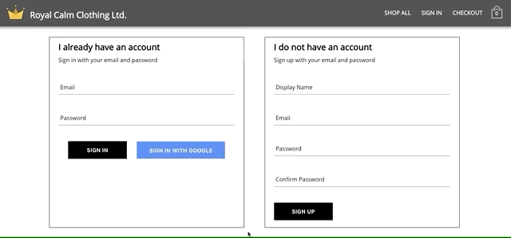
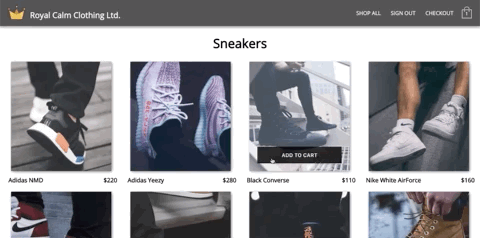
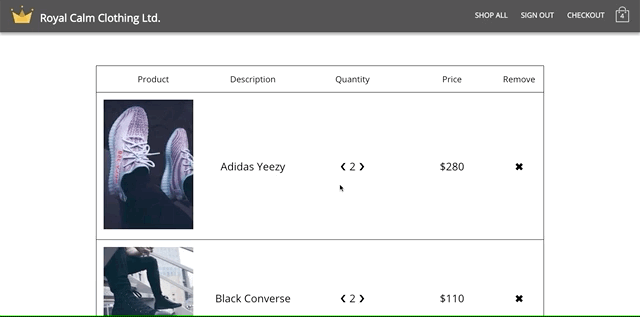

### Royal Calm Clothing Ltd. Summary

Royal Calm is an e-Commerce project that uses React for front-end and Google's Firebase as a back-end for secure user authorization and data storage. The project will utilize Stripe API as a secure payment system. Royal Calm utilizes many modern React libraries and focuses on organized, efficient and scalable code. 

## Home Page

## Sign In / Sign Up Capabilities

## Add to Cart

## Checkout Page

### Setup

Royal Calm is deployed via Heroku and can be found [here](https://royal-calm.herokuapp.com/)
*First page load may be slow as heroku server must wake up if there are no site visitors recently!

### Dependencies

-Firebase
-React
-React-redux
-React-router-dom
-Redux-persist
-Redux-thunk
-Reselect
-Styled-components

### Wishlist / Project Todo List
-Cart Notifications
-Mobile friendly/ Progressive Web App
-Implement GraphQL
-Filtering/search methods
-Animated landing page

